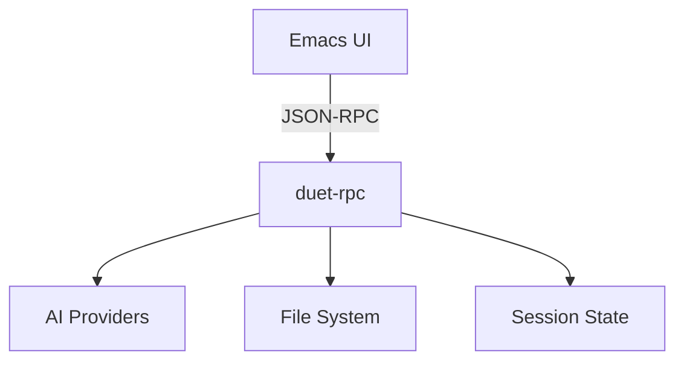

# DuetMacs Documentation Hub

Welcome to the DuetMacs project documentation. DuetMacs is an AI-assisted development system combining Emacs UI with a Haskell-based RPC backend (`duet-rpc`).

## Quick Navigation

### 🎯 Getting Started
- [[Project Overview]] - What is DuetMacs?
- [[Navigation Guide]] - How to use this documentation
- [[Feature Development Workflow]] - Our development process

### 🏗️ Architecture
- [[System Overview]] - High-level architecture
- [[duet-rpc Technical Architecture]] - Backend implementation details
- [[ADR Log]] - Architecture decision records

### ✨ Features & Capabilities
- [[Feature Inventory]] - Complete feature list
- [[Epic Roadmap]] - Implementation timeline and phases
- [[Implementation Status]] - Current progress tracking

### 📋 Current Epics (V1-Foundation)
- [[04-Epics/V1-Foundation/01-Project-Bootstrap/README|01-Project Bootstrap]] - CLI and Emacs plugin setup
- [[02-Chat to Patch]] - Single file editing
- [[03-Scoped Context]] - Context and templates
- [[04-Safety Controls]] - Guardrails and controls

### 🔧 Components
- [[Component Map]] - Overview of all components

### 🎨 UX Specifications
- [[Command Palette UX]] - Command discovery interface
- [[Subprocess Management UX]] - Process lifecycle management

### 🧪 Testing & Quality
- [[Test Strategy]] - Overall testing approach
- [[CI Smoke Checks]] - Continuous integration setup

### ⚠️ Risk & Process
- [[Risk Management]] - Practices and ownership
- [[10-Risk-Register/README|Risk Register]] - Story-specific registers

### 🔐 Operations
- [[Error Handling]] - Error management patterns (planned)
- [[Observability]] - Logging and monitoring (planned)
- [[Security Guidelines]] - Security best practices (planned)
- [[Performance Targets]] - Performance requirements (planned)

### 📚 Reference
- [[Glossary]] - Project terminology
- [[Configuration Reference]] - Settings and options (planned)
- [[API Documentation]] - Interface specifications (planned)

## Key Concepts

### Project Components

### Development Phases
- **V1-Foundation** - Core functionality (current)
- **V1.1-Enhancements** - Extended features
- **V2-Future** - Advanced capabilities

## Quick Links by Role

### For Developers
1. Start with [[Feature Development Workflow]]
2. Review [[System Overview]]
3. Check [[Epic Roadmap]] for current work

### For Contributors
1. Read [[Project Overview]]
2. Understand [[Test Strategy]]
3. Follow [[Security Guidelines]]

### For Users
1. See [[Feature Inventory]]
2. Check [[Implementation Status]]
3. Review [[Configuration Reference]]

## Project Status

Current Phase: **Planning**
Development Status: **Not Started**
Documentation: **In Progress**
Planned Epics: 11 (6 in V1-Foundation)
Identified Components: 15+

## Search Tags

Use these tags to find related content:
- `#epic/v1-foundation` - Current development
- `#component/cli` - CLI components
- `#component/emacs` - Emacs components
- `#architecture` - System design
- `#ux` - User experience
- `#testing` - Quality assurance
- `#operations` - Production concerns

---
*Last Updated: 2025-09-09*
