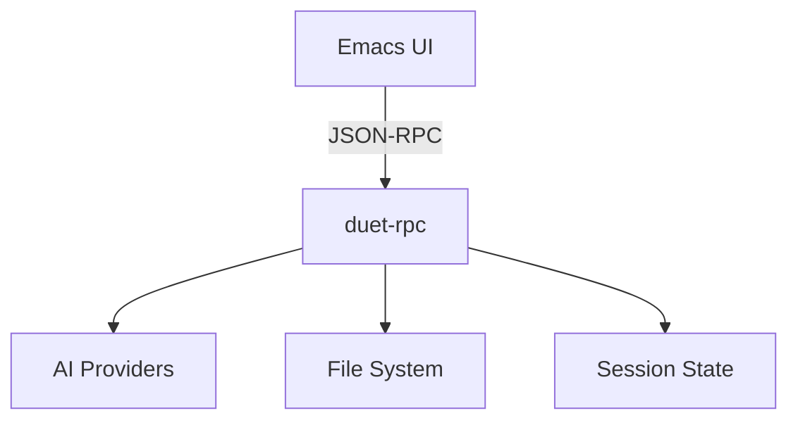

# DuetMacs Documentation Hub

Welcome to the DuetMacs project documentation. DuetMacs is an AI-assisted development system combining Emacs UI with a Haskell-based RPC backend (`duet-rpc`).

## Quick Navigation

### 🎯 Getting Started
- [[Project Overview]] - What is DuetMacs?
- [[Navigation Guide]] - How to use this documentation

### 🏗️ Architecture
- [[System Overview]] - High-level architecture
- [[duet-rpc Technical Architecture]] - Backend implementation details
- [[ADR Log]] - Architecture decision records

### ✨ Features & Capabilities
- [[Feature Inventory]] - Complete feature list
- [[Epic Roadmap]] - Implementation timeline and phases
- [[Implementation Status]] - Current progress tracking

### 📋 Current Epic (V1-Foundation)
- [[03-Epics/V1-Foundation/01-Project-Bootstrap/README|01-Project Bootstrap]] - CLI bootstrap and shared infrastructure

### 🔧 Components
- [[Component Map]] - Overview of all components

### 🎨 UX Specifications
- [[05-UX-Specifications/README|Story 001 UX Notes]] - CLI version/help flows

### 🧪 Testing & Quality
- [[Test Strategy]] - Overall testing approach

### ⚠️ Risk Management
- Risk registers are maintained within each story folder (e.g., `Stories/*/risk-register.md`)

## Key Concepts

### Project Components

### Development Phases
- **V1-Foundation** - Core functionality (current)

## Quick Links by Role

### For Developers
1. Review [[System Overview]]
2. Check [[Epic Roadmap]] for current work

### For Contributors
1. Read [[Project Overview]]
2. Understand [[Test Strategy]]

### For Users
1. See [[Feature Inventory]]
2. Check [[Implementation Status]]

## Project Status

Current Phase: **V1-Foundation**
Development Status: **CLI bootstrap in progress**
Documentation: **In Progress**
Planned Epics: 1 (Project Bootstrap)
Identified Components: 7 (CLI core)

## Search Tags

Use these tags to find related content:
- `#epic/v1-foundation` - Current development
- `#component/cli` - CLI components
- `#component/emacs` - Emacs components
- `#architecture` - System design
- `#ux` - User experience
- `#testing` - Quality assurance
- `#operations` - Production concerns

---
*Last Updated: 2025-09-29*
