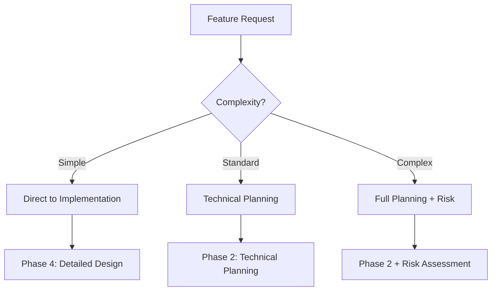

# Decision Points in Feature Development

## Overview

Critical decision points in the [[Feature Development Workflow]] that determine the path through development phases.

## Decision Point 1: Complexity & Scope Assessment

**When**: End of Phase 1 (Feature Planning)
**Purpose**: Determine workflow path based on complexity

### Assessment Criteria

| Complexity | Characteristics | Workflow Path |
|------------|----------------|---------------|
| **Simple** | • Single file change • No database modifications • No external dependencies • Clear requirements • < 2 hours estimated | Skip to Phase 4 (Detailed Design) |
| **Standard** | • Multiple files • Possible database changes • Some dependencies • 2-8 hours estimated | Continue to Phase 2 |
| **Complex** | • Multiple systems • Major architectural changes • External integrations • > 8 hours estimated | Phase 2 + Risk Assessment |

### Decision Matrix

## Decision Point 2: Risk Assessment

**When**: End of Phase 2 (Technical Planning)
**Purpose**: Identify high-risk factors requiring additional planning

### Risk Factors

| Risk Category      | Indicators                                                                   | Required Actions                                                          |
| ------------------ | ---------------------------------------------------------------------------- | ------------------------------------------------------------------------- |
| **External APIs**  | • Third-party services • Rate limits • Authentication                  | • API research • PoC implementation • Error handling plan           |
| **Security**       | • User data handling • Authentication/authorization • Encryption needs | • Threat modeling • Access control design • Data protection plan    |
| **Legacy Systems** | • Old codebase • Undocumented behavior • Technical debt                | • Pattern analysis • Dependency mapping • Compatibility planning    |

### Risk Response Strategies

1. **Mitigate**: Reduce probability or impact
2. **Transfer**: Use existing solutions/libraries
3. **Accept**: Acknowledge and monitor
4. **Avoid**: Change approach to eliminate risk

## Decision Point 3: Implementation Approach

**When**: Start of Phase 4 (Detailed Design)
**Purpose**: Choose implementation strategy

### Approach Options

| Approach | When to Use | Benefits | Drawbacks |
|----------|------------|----------|-----------|
| **Incremental** | • Low risk • Clear path • Divisible work | • Early feedback • Continuous integration • Reduced risk | • More integration work • Potential rework |
| **Big Bang** | • Atomic change needed • System-wide impact • Dependencies coupled | • Single integration • Consistent state | • Higher risk • Late feedback |
| **Parallel** | • Multiple options • Uncertain approach • A/B testing needed | • Risk mitigation • Comparison possible | • More effort • Throwaway work |
| **Spike First** | • Technical uncertainty • New technology • Feasibility questions | • Early validation • Learning opportunity | • Time investment • May be discarded |

## Decision Point 4: Testing Strategy

**When**: Phase 3 (Code Unit Planning)
**Purpose**: Determine testing approach

### Testing Levels

| Level | Coverage Target | When Required |
|-------|----------------|---------------|
| **Unit Tests** | 80-90% | Always |
| **Integration Tests** | 60-70% | Multiple components |
| **End-to-End Tests** | Critical paths | User-facing features |
| **Security Tests** | Attack vectors | Security-sensitive |

## Decision Framework

### Quick Decision Guide

1. **Can this be done in one file?** → Simple path
2. **Does it touch external systems?** → Risk assessment needed
3. **Are there security implications?** → Security review mandatory
4. **Will it affect existing users?** → Migration plan needed

### Escalation Triggers

Escalate planning when:
- Estimate exceeds 2 days
- Multiple teams involved
- Production data affected
- Breaking changes required
- Compliance implications

## Documentation Requirements

### By Complexity Level

| Level | Documentation Required |
|-------|----------------------|
| Simple | • Code comments • Commit message |
| Standard | • Design notes • Test plan • Update docs |
| Complex | • Architecture doc • Risk analysis • Migration guide |

## Related Documents

- [[Feature Development Workflow]] - Complete workflow
- [[Cross-Cutting Practices]] - Standards across all phases
- [[Test Strategy]] - Detailed testing approach
- [[Risk Management]] - Risk handling procedures
- [[10-Risk-Register/README|Risk Register]] - Centralized registers (by story)

---
*Navigation: [[00-Start-Here/README|Home]] > [[01-Process-and-Workflow]] > Decision Points*
