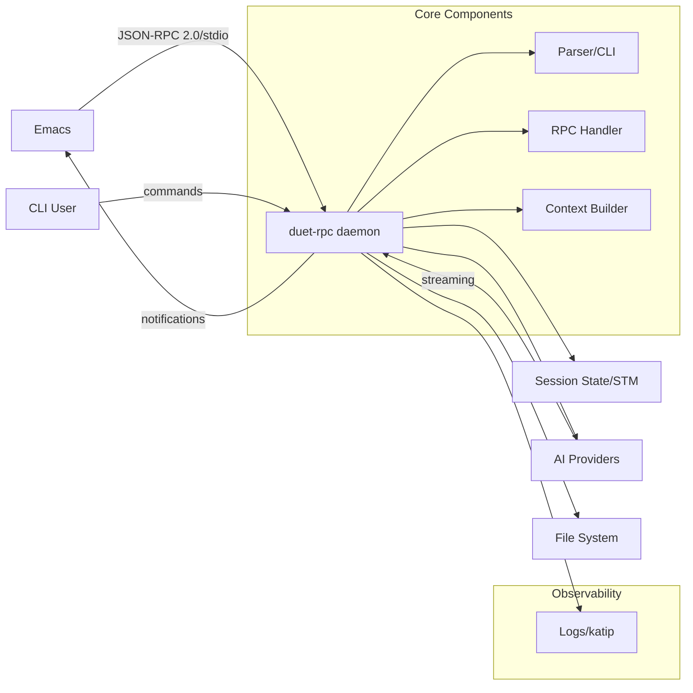

# Technical Architecture: duet-rpc

## Overview

`duet-rpc` is a Haskell-based RPC tool serving as the backend for AI-assisted development in Emacs. It operates in a hybrid model with both daemon mode for Emacs integration and one-shot CLI commands for scripting.

## System Architecture



## Key Architecture Decisions

### Process Model
- Hybrid architecture: Daemon for Emacs (low latency) + one-shot CLI commands (scripting)
- Concurrency: Green threads with STM for safe state management
- Single session: Queue/reject concurrent requests for simplicity

### Communication
- Protocol: JSON-RPC 2.0 over stdio with LSP-style length-prefixed framing
- Streaming: Progress notifications for AI token streaming
- Batching: 100ms update intervals for smooth Emacs UI

### Technology Stack
- Language: Haskell with GHC 9.10
- Build: Cabal with freeze files for reproducibility
- Core Libraries:
  - CLI: optparse-applicative
  - JSON: aeson + deriving-aeson
  - Logging: katip (structured)
  - HTTP: req (for AI providers)
  - Concurrency: async + STM
  - Config: tomland (TOML)

### Data & State
- Runtime state: STM with TVar/TMVar for concurrent safety
- Persistence: JSON files in the project directory
- Configuration: TOML with validation phase
- Backups: Timestamped .bak files before modifications

### Safety & Security
- File operations: Dry-run with confirmation, path canonicalization, jail to project root
- Error handling: Typed ADTs everywhere for explicit, safe error handling
- Credentials: Environment variables only (standard practice)
- Process recovery: Auto-restart with exponential backoff

### Quality
- Testing: Property tests (hedgehog) for core logic, unit tests for integration (tasty framework)
- Linting: hlint + ormolu for consistent code
- Logging: Four levels (error, warn, info, debug) with --debug flag for RPC dumps

## Non-Functional Requirements

### Performance Targets
- RPC ping latency: <100ms
- Context assembly: <500ms
- Token streaming: Batched every ~100ms
- Simple commands: ~100ms response time

### Resource Limits
- Max file size: 1MB per file
- Total context: 10MB per request
- Memory budget: <500MB
- Concurrency: Single session only

### Reliability
- Auto-restart on crash with backoff
- Smart retry for transient errors (3x)
- Configurable timeout (60s default)
- No data loss via mandatory backups

## Implementation Structure

### Module Organization
```
src/
  DuetRpc/
    CLI/           -- optparse-applicative parsers ([[CLI Parser|Parser Component]])
    RPC/           -- JSON-RPC handling ([[Component Map#RPC Components|RPC Handler]])
    Providers/     -- AI provider clients ([[Epic Roadmap#Epic: Provider Switch & Token Budget|Provider Integration]])
    Context/       -- Context assembly ([[03-Scoped Context|Context Building]])
    Session/       -- Session management ([[Epic Roadmap#Epic: Persistence & History|Session Persistence]])
    FileOps/       -- Safe file operations ([[04-Safety Controls|Safety Implementation]])
    Config/        -- Configuration ([[Config Loader|Config Component]])
    Logging/       -- Katip setup ([[Logger|Logger Component]])
    Types/         -- Shared types and errors ([[Error Handler|Error Management]])
```

### Error Type Hierarchy
```haskell
data DuetError
  = ConfigError ConfigError
  | RPCError RPCError
  | ProviderError ProviderError
  | FileError FileError
  | SessionError SessionError
  deriving (Show, Eq)
```

### Configuration Precedence
1. Command-line flags
2. Environment variables
3. Project `.duet-rpc.toml`
4. User config (`~/.config/duet-rpc/config.toml`)
5. System defaults

## Quality Gates

- All architecture decisions documented and accepted
- NFR targets specified with measurable criteria
- Error handling strategy consistently applied
- Security considerations explicitly addressed
- Testing approach defined with framework choices

---

Notes
- Naming: `codex` refers to OpenAI's CLI; `claude-code` refers to Anthropic's CLI; `duet-rpc` is our RPC/CLI binary used by Emacs and for one-shots, supporting both providers.
- v1 targets Emacs UI + duet-rpc over stdio; no network server required.
- CLI proposes patches; Emacs applies edits after user approval (dry-run by default, allowlist paths, size/file caps).
