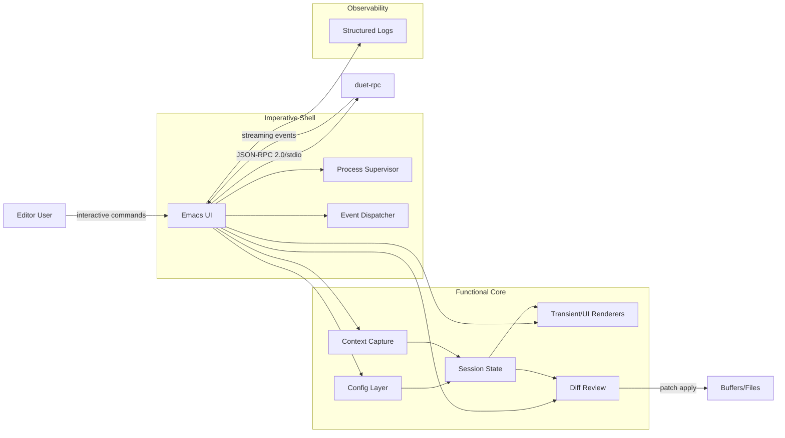

# Technical Architecture: Emacs UI

## Overview

The Emacs UI is an Emacs Lisp package that delivers the user experience for duetmacs. It mediates every interaction between the editor and `duet-rpc`, applies approved edits to buffers, and exposes configuration, keybindings, and status feedback. The UI follows the system responsibilities outlined in [[System Overview|../System Overview]] while mirroring the RPC architecture for consistency and maintainability.

## System Architecture



## Key Architecture Decisions

### Process Model
- Runs entirely inside Emacs, supervising a single long-lived `duet-rpc` subprocess per editor instance.
- Separates a small imperative shell (`duet-transport`) from pure data transforms (`duet-core`, `duet-context`, `duet-diff`) to keep logic testable and deterministic.
- Uses event queues (per session) to serialize streaming updates while keeping UI rendering responsive on the main thread.

### Communication
- Protocol: JSON-RPC 2.0 framed over stdio, leveraging Emacs 29+ `jsonrpc` APIs for request/response handling.
- Streaming: Progress and patch notifications fan into dispatcher hooks which update model state before rendering.
- Heartbeat: 30s keepalive ping mirrors [[System Overview|../System Overview#4-Error-Handling-|-Recovery]] with exponential backoff reconnects.

### Technology Stack
- Emacs 29+; lexical binding enabled for every module.
- Core libraries: `jsonrpc`, `cl-lib`, `seq`, `map`, `subr-x`, `pcase`, `rx`, `transient`, `tabulated-list`, `diff-mode`, `project`, `files`, `auth-source`.
- Optional integrations: `use-package` for configuration blocks, `compat` for backports when targeting earlier Emacs releases.
- Packaging: `Package-Requires` header for ELPA/MELPA distribution; autoload cookies for interactive entry points.

### Data & State
- Session state stored in immutable-plist records copied on update to avoid shared mutation; exposes read-only accessors for UI components.
- Configuration precedence: command arguments → project `.duetmacs.el` → directory-local variables → user `custom-file` → defaults.
- Transcript/cache data persisted by `duet-rpc`; Emacs retains lightweight UI state only, reducing corruption risk.

### Safety & Security
- Enforces explicit approval flow: commands collect patches into review buffers before applying edits.
- Validates file paths against project root allowlists; prompts if edits touch ignored or binary files.
- Scrubs secrets from logs and transient buffers; relies on `auth-source` for provider credentials.
- Automatically unregisters hooks and timers on teardown to avoid stale background tasks.

### Quality
- Testing: module-level ERT suites plus integration tests that spin up a fake JSON-RPC echo process.
- Linting: `checkdoc`, `package-lint`, and byte-compilation warnings treated as CI gates.
- Documentation: every public command/variable carries `defgroup`/`defcustom` metadata and user-facing docstrings.
- Observability: structured logging via `duet-logger` helpers funnels to Emacs *Messages* buffer and optional files with severity filtering.

## Non-Functional Requirements

### Responsiveness
- Command palette actions should open UI surfaces within 150ms.
- Streaming token updates render incrementally with <250ms between frames.
- Background operations never block redisplay; long tasks schedule via timers or `run-with-idle-timer`.

### Reliability
- Three handshake attempts on startup with backoff (1s, 2s, 4s) before surfacing failure UI.
- Automatic recovery pipeline: detect process exit, show status banner, queue pending requests, replay after reconnect or timeout at 60s.
- Graceful degradation: read-only inspection commands stay available when `duet-rpc` is offline.

### Compatibility
- Emacs 29 is baseline; compatibility layer isolates optional features needing later releases.
- Keybindings and transients default to discoverable prefixes, avoiding conflicts with popular packages.

## Implementation Structure

### Module Organization
```
lisp/
  duet-core.el        -- Command registry, dispatcher, public API (interactive entry points)
  duet-transport.el   -- Process supervisor, JSON-RPC client, heartbeat & retry logic
  duet-context.el     -- Context capture, prompt templating, and scope resolution helpers
  duet-ui.el          -- Transient/minibuffer UX, status surfaces, message rendering
  duet-diff.el        -- Patch buffers, ediff integration, apply/rollback helpers
  duet-config.el      -- Configuration loading, precedence resolution, customization group
  duet-logger.el      -- Structured logging façade aligned with [[../duet-rpc/duet-rpc Technical Architecture|duet-rpc logger]]
  duet-tests.el       -- ERT suites and test doubles for JSON-RPC
```

### Key Abstractions
- `duet-command` struct: names, descriptions, handlers, required capabilities, and UI affordances.
- `duet-session` struct: holds transport handles, pending requests, transcript metadata, and status indicators.
- Hook surfaces (`duet-before-send-hook`, `duet-after-receive-hook`) for extensions while preserving core invariants.
- Service locator via dispatcher table rather than ad-hoc conditionals to keep extensibility consistent with CLI registry pattern.

## Quality Gates
- Architecture decisions recorded in this document and signed off before implementation.
- Module boundaries enforced: no transport calls from UI code and vice versa without going through dispatcher APIs.
- Byte-compilation clean (no warnings) plus green ERT suites required before merging.
- User-facing commands documented in `duetmacs-docs/03-Features/Feature Inventory.md` as they are implemented.

---

Notes
- Mirrors the responsibilities captured in [[System Overview|../System Overview#1-Emacs-UI-|-ELisp]].
- Leverages the same safety constraints as [[../duet-rpc/duet-rpc Technical Architecture|duet-rpc]] to provide consistent guardrails across components.
- Future adapters (MCP, local daemon) consume the same dispatcher and hook APIs to avoid coupling UI surfaces to transport particulars.
