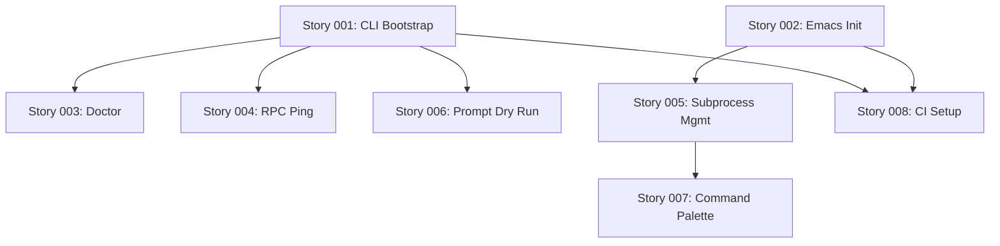

# Project Bootstrap Stories

## Story List

### Core CLI Stories
1. **[[001-cli-version-help-bootstrap/001-cli-version-help-bootstrap|Story 001: CLI Version/Help Bootstrap]]**
   - Basic CLI binary with version and help commands
   - Logging infrastructure
   - Output formatting
   - Components: Logger, Output Formatter, Version Manager, Help Formatter

2. **[[003-cli-doctor/003-cli-doctor|Story 003: CLI Doctor Command]]**
   - Environment verification
   - Dependency checking

3. **[[004-cli-rpc-ping/004-cli-rpc-ping|Story 004: CLI RPC Ping]]**
   - Basic RPC connectivity test
   - RPC handshake verification
   - Timeout handling

4. **[[006-cli-prompt-dry-run/006-cli-prompt-dry-run|Story 006: CLI Prompt Dry Run]]**
   - No-op prompt processing
   - File input handling
   - Dry-run mode foundation

### Emacs Integration Stories
2. **[[002-emacs-init-health/002-emacs-init-health|Story 002: Emacs Init & Health]]**
   - Package initialization
   - Health check commands
   - Basic UI setup

5. **[[005-emacs-subprocess-mgmt/005-emacs-subprocess-mgmt|Story 005: Emacs Subprocess Management]]**
   - Process lifecycle handling
   - Start/stop/restart commands
   - Process monitoring

7. **[[007-emacs-command-palette/007-emacs-command-palette|Story 007: Emacs Command Palette]]**
   - Command discovery interface
   - Transient menu setup
   - Keybinding configuration

### Infrastructure Stories
8. **[[008-ci-smoke-checks/008-ci-smoke-checks|Story 008: CI Smoke Checks]]**
   - GitHub Actions setup
   - Build and test automation
   - Cross-platform validation

## Story Dependencies

## Completion Criteria
All stories must be complete before the Project Bootstrap epic is considered done. Each story has its own acceptance criteria defined in its specification.

## Components Created
Through these stories, the following components are established:
- Output Formatter
- Version Manager
- Logger
- Config Loader
- Help Formatter
- Error Handler
- CLI Parser

---
*Navigation: [[00-Start-Here/README|Home]] > [[04-Epics]] > [[04-Epics/V1-Foundation/01-Project-Bootstrap/README|01-Project Bootstrap]] > Stories*
